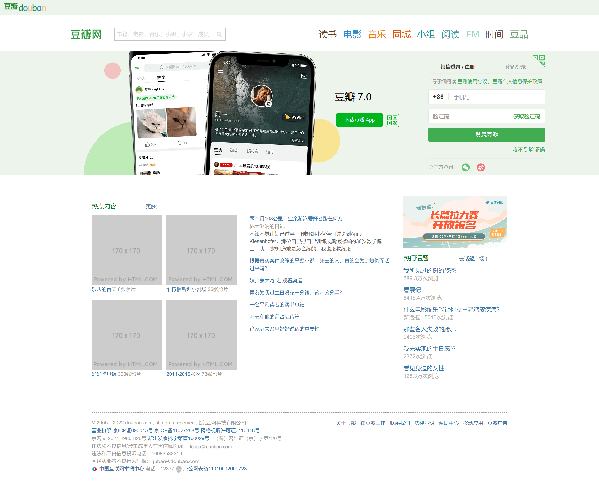
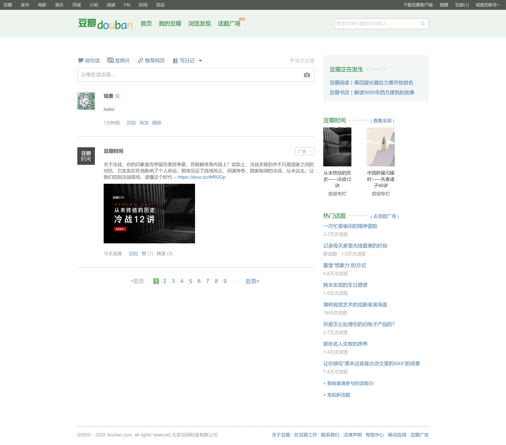
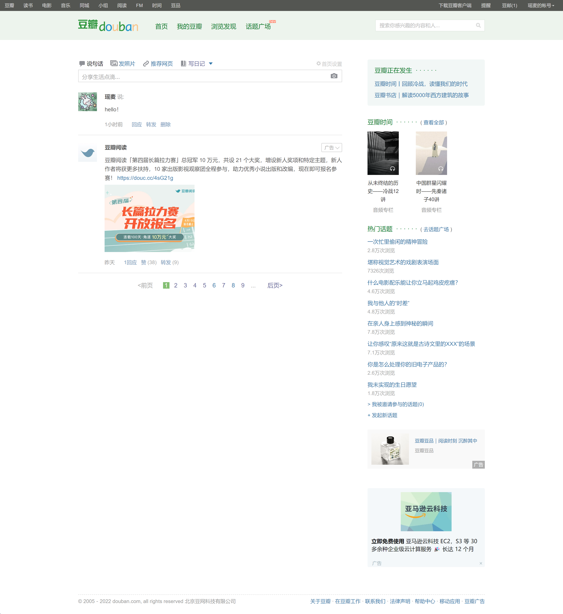
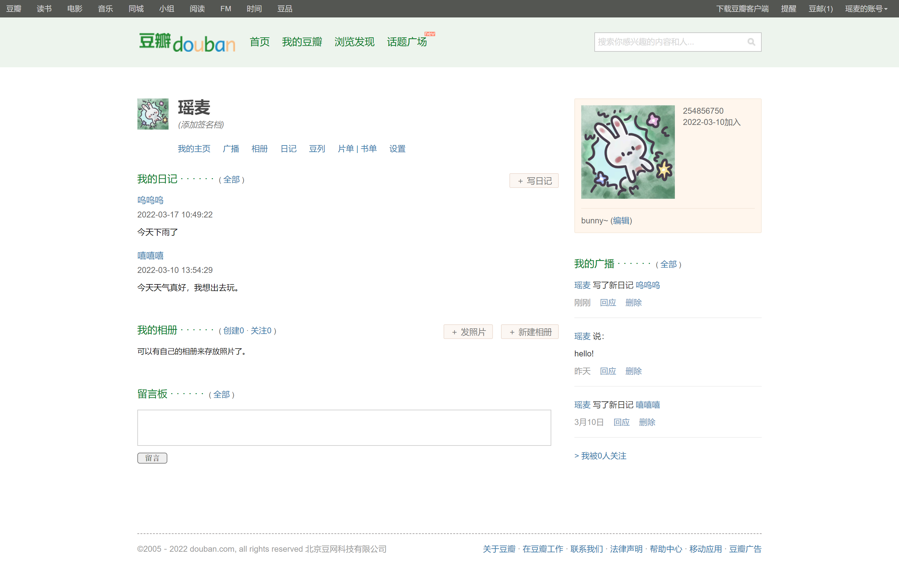
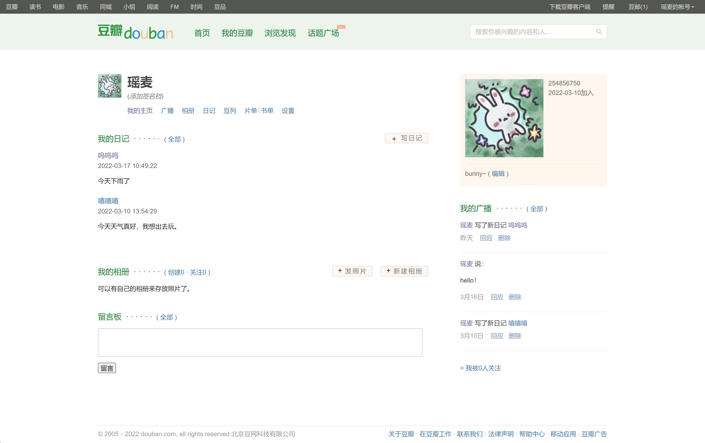

# douban
用原生html仿写的豆瓣页面（登录注册页、首页、个人主页）

## CSS和DOM练习
1. CSS样式仿写
2. 学习网页架构，使用html5的语义化标签
3. 使用浮动、定位等布局
4. 使用精灵图，设置background-position属性控制小图标显示
5. 使用iframe标签嵌套页面

## 收获
1. 右边元素代码位置可以先写在其他元素前面，浮动到右侧。
2. 浮动和相对定位可以混用，浮动和绝对定位不能混用。
3. 绝对定位加`top`和`left` = 用浮动加`margin`
4. 利用`border`画箭头
5. `z-index`仅能在定位元素上奏效
6. `input`和`button`同行对齐问题可以给`button`加上`vertical-align: middle;`
7. 显示滚动条`overflow-y:scroll;`

## 页面展示
### 登录注册页
[在线预览](https://bunny0927.github.io/douban/pre.html)
#### 仿写页面

#### 参照页面

### 首页
[在线预览](https://bunny0927.github.io/douban/homepage.html)
#### 仿写页面

#### 参照页面

### 个人主页
[在线预览](https://bunny0927.github.io/douban/mypage.html)
#### 仿写页面

#### 参照页面

